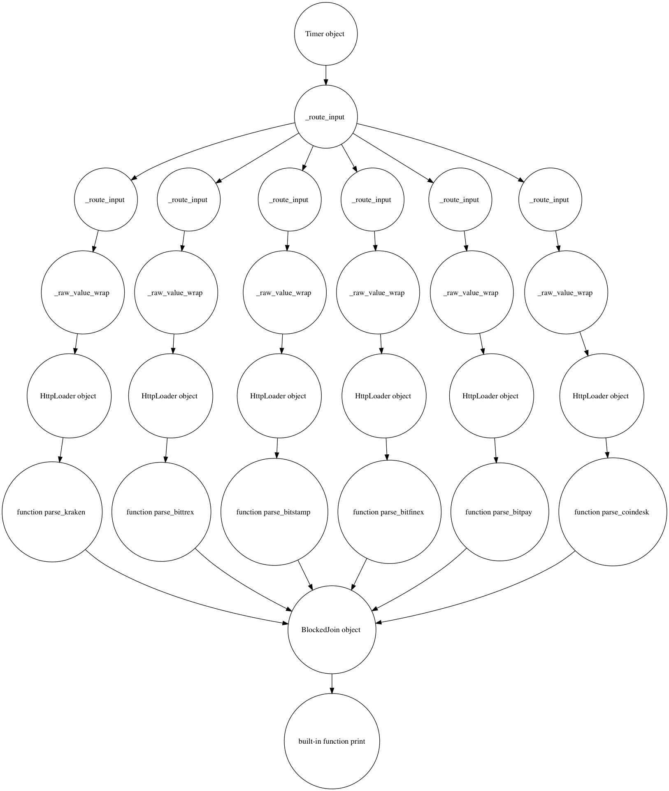

=======
Botflow
=======
0.2.0 alpha

* Data-driven programming framework
* Paralleled in coroutines and ThreadPool
* Type- and content-based route function
* Interactive programming with Jupyter Notebook

Requirements
------------
`Graphviz <http://brewformulas.org/Graphviz>`_.

Installing
----------

Install and update using ``pip``:

`pip install -U botflow`

Documentation
------------

http://botflow.readthedocs.io

What's data-driven programming?
===============================

All functions are connected by pipes (queues) and communicate by data.  

When data come in, the function will be called and return the result.

Think about the pipeline operation in unix: ``ls|grep|sed``.

Benefits:

#. Decouple data and functionality
#. Easy to reuse 

Botflow provides pipe and route. It makes data-driven programming and powerful data flow processes easier.

Botflow is...
=============

- **Simple**

Botflow is easy to use and maintain, *does not need configuration files*, and knows about ``asyncio`` and how to parallelize computation.

Here's one of the simple applications you can make:

_Load the price of Bitcoin every 2 seconds. Advantage price aggregator sample can be found `here <https://github.com/kkyon/Botflow/tree/master/examples>`_.

.. code-block:: python

    from botflow import *

    def main():
        Pipe(

            Timer(delay=2),  # send timer data to pipe every 2 seconds
            "http://api.coindesk.com/v1/bpi/currentprice.json",  # send url to pipe when timer trigger
            HttpLoader(),  # read url and load http response
            lambda r: r.json['bpi']['USD']['rate_float'],  # read http response and parse as json
            print,  # print out

        )

        Bot.render('ex_output/simple_bitcoin_price')
        Bot.run()
    main()

**Or write in chain style**

.. code-block:: python

    from botflow import *
    p_cd_bitcoin=Pipe().Timer(delay=2).Loop("http://api.coindesk.com/v1/bpi/currentprice.json")\
                .HttpLoader().Map(lambda r: r.json['bpi']['USD']['rate_float']).Map(print)

    p_cd_bitcoin.run()

- **Http server Support OOB**  Publish your data pipe to public quickly.

.. code-block:: python

    from botflow import *
    from aiohttp import web

    p = Pipe(

        {"msg":"hello world!"}
    )

    app = web.Application()

    app.add_routes([
        web.get('/', p.aiohttp_json_handle)
    ])

    Bot.run_app(app)
    #BotFlow start web server http://0.0.0.0:8080

- **Flow Graph**
With render function:
`Bot.render('bitcoin_arbitrage')`
Botflow will render the data flow network into a graphviz image.
below is the flow graph generated by Botflow.Aggreate 6 exchanges bitcoin price for trading.

 

- **Fast**
Nodes will be run in parallel, and they will perform well when processing stream data.
:Web Crawle: Botflow is 10x fatter than Scrapy

 

- **Replay-able**

With replay mode enabled:
``config.replay_mode=True``
when an exception is raised at step N, you don't need to run from setup 1 to N.
Botflow will replay the data from nearest completed node, usually step N-1.
It will save a lot of time in the development phase.

Release

:**0.2.0**: Milestone release.:

            # Jupyter support. Able to run inside Jupyter note book.

            # pipe can be nest in another Pipe.

            p1=Pipe(get_image)
            p2=Pipe(get_price)
            p_get_all=Pipe(Zip(p1,p2)).Filter

            # Support Chain style pipe line creating.

                Pipe(range(1,10)).Map(lambda x:x+1).Fiter(lambda x:x>2)

                same as :

                Pipe(range(1,10),lambda x:x+1,Filter(lambda x:x>2))

:**0.1.9**: Major change see below .:

            # Backpressure rate limit support

            # Httpserver support

            # new Node support. *Zip*, *SendTo* *Flat* for make loop and redirect the flow

            # Type hints support .for function type route

            # reorge the source code for readable.

:**0.1.8**: http://docs.botflow.org/en/latest/change/0.1.8.html .:
            
            #. Support parallel in ThreadPool for slow function.
            
            #. Loop Node  is  deprecated. raw value and Iterable value can be used directly.
            
            #. improve performance of BlockedJoin
            
:**0.1.7**: 

RoadMap
=======
- Will add Httpserver support(REST,Websocket).  
- Will support server machine learning Model online.
- Finshe the api reference doc.
- Rename project to Botflow.?

More about Botflow
===============

Data-driven programming is typically applied to streams of structured data for filtering, transforming, aggregating (such as computing statistics), or calling other programs.

Botflow has a few basic concepts to implement Data-driven programming .

- **Source**
        It is feed stream data to the pipe.

    * **Timer**: It will send a message in the pipe by timer param. **delay**, **max_time** **until** some finished
    * **Pipe.run**: you can use Pipe.run to trigger the data into pipe. By default it will feed int **0**

- **Function**
        It is callable unit.Any callable function and object can work as Node. It is driven by data. Custom functions work as Map unit.
        There are some built-in nodes:

   

   * **Fetch**: (Alias:HttpLoader)  Get a url and return the HTTP response
   * **AioFile**: for file I/O.
   * **SpeedLimit**: limit the stream speed limit
   * **Delay**: delay in special second.
   * **Map**  : Work ad Convert unit.
   * **Filter** : Drop data from pipe if it does not match some condition
   * **Flat** : Drop data from pipe if it does not match some condition

- **Route**
        It will be used to create a complex data flow network, not just one main process. Botflow can nest Routes inside Routes.
        It is a powerful concept.
        There are some pre built-in Route:
    * **Pipe**: It is the main stream process of the program. All units will work inside.
    * **Tee** : (Alias:Branch) Duplicate data from parent pipe to a child pipe as branch.
    * **Zip** :   Combine multi pipes result to list.
    * **Link**: (Alias: LinkTo)  Route flow to any Node or Route for making loop , circle

All units (Pipe, Node, Route) communicate via queues and perform parallel computation in coroutines.
This is abstracted so that Botflow can be used with only limited knowledge of ``asyncio``.

      

Contributing
------------

Donate
------

Links
-----
