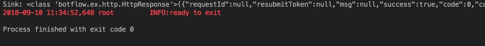

lagou_spider（拉勾职位爬虫）
==========================

假设你接到一个需要，让你利用拉勾的招聘JD,调查Python程序在北上深杭的薪资情况。需要你写个爬虫来完成。

本文需要工具
-----------

:Chrome: 用于网页请求包抓取

:Botflow: 用于爬虫编写

:Pycharm CE: 用于代码编程。


如何安装Botflow:
---------------
    ```pip install -U botflow```


使用chrome获取请求内容
--------------------

#. 打开chrome 开发者工作，

#. 切换到 XHR ,这种模式只会抓取 Ajax请求

#. 在拉勾网页上搜索，北京地区的，python岗位，然后翻页。在开发者工具中，你就可以看到，positionAjax.json 相关的请求。

    .. image:: lagou1.jpg

    .. image:: lagou2.jpg

#. 右键选中，Copy > Copy request headers.

    .. code-block::  Text

        POST /jobs/positionAjax.json?city=%E5%8C%97%E4%BA%AC&needAddtionalResult=false HTTP/1.1
        Host: www.lagou.com
        Connection: keep-alive
        Content-Length: 26
        Pragma: no-cache
        Cache-Control: no-cache
        Origin: https://www.lagou.com
        X-Anit-Forge-Code: 0
        User-Agent: Mozilla/5.0 (Macintosh; Intel Mac OS X 10_13_6) AppleWebKit/537.36 (KHTML, like Gecko) Chrome/68.0.3440.106 Safari/537.36
        Content-Type: application/x-www-form-urlencoded; charset=UTF-8
        Accept: application/json, text/javascript, */*; q=0.01
        X-Requested-With: XMLHttpRequest
        X-Anit-Forge-Token: None
        Referer: https://www.lagou.com/jobs/list_python?labelWords=&fromSearch=true&suginput=
        Accept-Encoding: gzip, deflate, br
        Accept-Language: zh-CN,zh;q=0.9,en;q=0.8,zh-TW;q=0.7
        Cookie: _ga=GA1.2.1690296475.1518425441; user_trace_token=20180212165041-cde58656-0fd1-11e8-8654-525400f775ce; LGUID=20180212165041-cde58a1b-0fd1-11e8-8654-525400f775ce; gray=resume; sensorsdata2015jssdkcross=%7B%22distinct_id%22%3A%228310232%22%2C%22%24device_id%22%3A%22162fbe017557-0454a54748a333-336c7b05-1764000-162fbe01756131a%22%2C%22props%22%3A%7B%22%24latest_traffic_source_type%22%3A%22%E7%9B%B4%E6%8E%A5%E6%B5%81%E9%87%8F%22%2C%22%24latest_referrer%22%3A%22%22%2C%22%24latest_referrer_host%22%3A%22%22%2C%22%24latest_search_keyword%22%3A%22%E6%9C%AA%E5%8F%96%E5%88%B0%E5%80%BC_%E7%9B%B4%E6%8E%A5%E6%89%93%E5%BC%80%22%7D%2C%22first_id%22%3A%22162fbe017557-0454a54748a333-336c7b05-1764000-162fbe01756131a%22%7D; LG_LOGIN_USER_ID=2c307fca8f7021f2bcb48e09504f48685acb6eac181de81c; showExpriedIndex=1; showExpriedCompanyHome=1; showExpriedMyPublish=1; hasDeliver=0; JSESSIONID=ABAAABAABEEAAJAE07FBC7D4DF87B66F2D4043894D889A7; _putrc=6371D2A6DE42118C; login=true; mds_u_n=%5Cu8d1d%5Cu58f3%5Cu91d1%5Cu63a7%5Cu5317%5Cu4eac; mds_u_ci=159558; X_HTTP_TOKEN=ee02191ab39aeafe8221a97bdbc5d06f; Hm_lvt_4233e74dff0ae5bd0a3d81c6ccf756e6=1534149795,1534919704; yun_switch_company=1; _gid=GA1.2.236062443.1536480058; LGSID=20180909160058-7c6bb276-b406-11e8-b62b-5254005c3644; PRE_UTM=; PRE_HOST=; PRE_SITE=; PRE_LAND=https%3A%2F%2Fwww.lagou.com%2F; gate_login_token=cf101a24f676e9e598be30fb739271f3ff8e76bfbec59f83; mds_u_cn=%5Cu8d1d%5Cu58f3%5Cu91d1%5Cu79d1%5Cu63a7%5Cu80a1%5Cu6709%5Cu9650%5Cu516c%5Cu53f8; mds_u_s_cn=%5Cu8d1d%5Cu58f3%5Cu91d1%5Cu670d; unick=18800118876; yun_push_authToken="JZfh+Grg9GvCxIVJVfHfI8KjD/G0bxVo0HtuvLII5/Xm2NlGNg1UsHxxDJqQFc9fnGoyeBZvhUfuvY8Mto3upBWRPaYAk7heQlCWp63hWDaDJ2uyAFAq3DTK7j24YxX7e7g1RVQvFTZW5KbQFd0sMQxCv4X/4NwrwsS/v5aXU+x4rucJXOpldXhUiavxhcCELWDotJ+bmNVwmAvQCptcy5e7czUcjiQC32Lco44BMYXrQ+AIOfEccJKHpj0vJ+ngq/27aqj1hWq8tEPFFjdnxMSfKgAnjbIEAX3F9CIW8BSiMHYmPBt7FDDY0CCVFICHr2dp5gQVGvhfbqg7VzvNsw=="; mds_login_authToken="OLzLRoAc/eD6AABAewCWpbIJ/eu8qBHKDjhbdDnbV9JdlQrgjiZ+LWjOaziTjnZP77x9C5OlLk4DFgWJFQ8ekmw27Av1P+GjJ8WNV82JuqEuRpQKnHSmTWaLosUgWRvrYi7/C/KiuNlQWdVzDdRn2Wir0LqzdL/PqN28NmThSXd4rucJXOpldXhUiavxhcCELWDotJ+bmNVwmAvQCptcy5e7czUcjiQC32Lco44BMYXrQ+AIOfEccJKHpj0vJ+ngq/27aqj1hWq8tEPFFjdnxMSfKgAnjbIEAX3F9CIW8BSiMHYmPBt7FDDY0CCVFICHr2dp5gQVGvhfbqg7VzvNsw=="; index_location_city=%E5%85%A8%E5%9B%BD; TG-TRACK-CODE=search_code; SEARCH_ID=dce8f7fa57814b2ba25a330df122cce5; Hm_lpvt_4233e74dff0ae5bd0a3d81c6ccf756e6=1536480724; LGRID=20180909161204-09522e65-b408-11e8-b62b-5254005c3644; _ga=GA1.2.1690296475.1518425441; user_trace_token=20180212165041-cde58656-0fd1-11e8-8654-525400f775ce; LGUID=20180212165041-cde58a1b-0fd1-11e8-8654-525400f775ce; gray=resume; sensorsdata2015jssdkcross=%7B%22distinct_id%22%3A%228310232%22%2C%22%24device_id%22%3A%22162fbe017557-0454a54748a333-336c7b05-1764000-162fbe01756131a%22%2C%22props%22%3A%7B%22%24latest_traffic_source_type%22%3A%22%E7%9B%B4%E6%8E%A5%E6%B5%81%E9%87%8F%22%2C%22%24latest_referrer%22%3A%22%22%2C%22%24latest_referrer_host%22%3A%22%22%2C%22%24latest_search_keyword%22%3A%22%E6%9C%AA%E5%8F%96%E5%88%B0%E5%80%BC_%E7%9B%B4%E6%8E%A5%E6%89%93%E5%BC%80%22%7D%2C%22first_id%22%3A%22162fbe017557-0454a54748a333-336c7b05-1764000-162fbe01756131a%22%7D; showExpriedIndex=1; showExpriedCompanyHome=1; showExpriedMyPublish=1; hasDeliver=0; JSESSIONID=ABAAABAABEEAAJAE07FBC7D4DF87B66F2D4043894D889A7; mds_u_n=%5Cu8d1d%5Cu58f3%5Cu91d1%5Cu63a7%5Cu5317%5Cu4eac; mds_u_ci=159558; X_HTTP_TOKEN=ee02191ab39aeafe8221a97bdbc5d06f; Hm_lvt_4233e74dff0ae5bd0a3d81c6ccf756e6=1534149795,1534919704; yun_switch_company=1; _gid=GA1.2.236062443.1536480058; mds_u_cn=%5Cu8d1d%5Cu58f3%5Cu91d1%5Cu79d1%5Cu63a7%5Cu80a1%5Cu6709%5Cu9650%5Cu516c%5Cu53f8; mds_u_s_cn=%5Cu8d1d%5Cu58f3%5Cu91d1%5Cu670d; LGSID=20180910110134-d3475ab4-b4a5-11e8-b62b-5254005c3644; PRE_UTM=; PRE_HOST=; PRE_SITE=; PRE_LAND=https%3A%2F%2Fwww.lagou.com%2F; gate_login_token=21d2ec82a5c90746ab0a09e3014903592062af3c2a0e44a3; yun_push_authToken="K3X2PunJpOPcH6Jps7SH2GIRGCFgFXxWS73fruNGbe5BLuIDysbZl2SSsqWlCQOmGY8KGQl8UWoJ08WEvZtQHQd2R4sMO1Q6skl77olVWj4P6T4vls04NALTvIJxMxC4zd9CJ+eIEJBemWIFuPIzMIQenQ3GU870INQTDV8C2xh4rucJXOpldXhUiavxhcCELWDotJ+bmNVwmAvQCptcy5e7czUcjiQC32Lco44BMYXrQ+AIOfEccJKHpj0vJ+ngq/27aqj1hWq8tEPFFjdnxMSfKgAnjbIEAX3F9CIW8BSiMHYmPBt7FDDY0CCVFICHr2dp5gQVGvhfbqg7VzvNsw=="; login=false; unick=""; mds_login_authToken=""; _putrc=""; LG_LOGIN_USER_ID=""; index_location_city=%E5%8C%97%E4%BA%AC; TG-TRACK-CODE=index_search; SEARCH_ID=3658325e35c04672893f1f53b3b929da; Hm_lpvt_4233e74dff0ae5bd0a3d81c6ccf756e6=1536548672; LGRID=20180910110432-3dbd334a-b4a6-11e8-b62b-5254005c3644

#. Query String内容保存下来

    .. code-block:: Text

        city=%E5%8C%97%E4%BA%AC&needAddtionalResult=false

#. Form Data内容保持下来
    .. code-block:: Text

        first=false&pn=3&kd=python


##所有需要抓取的信息都在这里。##下面就可以开始撸代码了。##


第一版本：
--------
使用pip安装，确保你用的python3.6 有的同学可能需要pip3命令。
    ```pip install -U botflow```  or  ```pip3 install -U botflow```

.. code-block:: python

    from botflow import *

    request_headers="""
    POST /jobs/positionAjax.json?city=%E5%8C%97%E4%BA%AC&needAddtionalResult=false HTTP/1.1
    Host: www.lagou.com
    Connection: keep-alive
    Content-Length: 26
    Pragma: no-cache
    Cache-Control: no-cache
    Origin: https://www.lagou.com
    X-Anit-Forge-Code: 0
    User-Agent: Mozilla/5.0 (Macintosh; Intel Mac OS X 10_13_6) AppleWebKit/537.36 (KHTML, like Gecko) Chrome/68.0.3440.106 Safari/537.36
    Content-Type: application/x-www-form-urlencoded; charset=UTF-8
    Accept: application/json, text/javascript, */*; q=0.01
    X-Requested-With: XMLHttpRequest
    X-Anit-Forge-Token: None
    Referer: https://www.lagou.com/jobs/list_python?labelWords=&fromSearch=true&suginput=
    Accept-Encoding: gzip, deflate, br
    Accept-Language: zh-CN,zh;q=0.9,en;q=0.8,zh-TW;q=0.7
    Cookie: _ga=GA1.2.1690296475.1518425441; user_trace_token=20180212165041-cde58656-0fd1-11e8-8654-525400f775ce; LGUID=20180212165041-cde58a1b-0fd1-11e8-8654-525400f775ce; gray=resume; sensorsdata2015jssdkcross=%7B%22distinct_id%22%3A%228310232%22%2C%22%24device_id%22%3A%22162fbe017557-0454a54748a333-336c7b05-1764000-162fbe01756131a%22%2C%22props%22%3A%7B%22%24latest_traffic_source_type%22%3A%22%E7%9B%B4%E6%8E%A5%E6%B5%81%E9%87%8F%22%2C%22%24latest_referrer%22%3A%22%22%2C%22%24latest_referrer_host%22%3A%22%22%2C%22%24latest_search_keyword%22%3A%22%E6%9C%AA%E5%8F%96%E5%88%B0%E5%80%BC_%E7%9B%B4%E6%8E%A5%E6%89%93%E5%BC%80%22%7D%2C%22first_id%22%3A%22162fbe017557-0454a54748a333-336c7b05-1764000-162fbe01756131a%22%7D; LG_LOGIN_USER_ID=2c307fca8f7021f2bcb48e09504f48685acb6eac181de81c; showExpriedIndex=1; showExpriedCompanyHome=1; showExpriedMyPublish=1; hasDeliver=0; JSESSIONID=ABAAABAABEEAAJAE07FBC7D4DF87B66F2D4043894D889A7; _putrc=6371D2A6DE42118C; login=true; mds_u_n=%5Cu8d1d%5Cu58f3%5Cu91d1%5Cu63a7%5Cu5317%5Cu4eac; mds_u_ci=159558; X_HTTP_TOKEN=ee02191ab39aeafe8221a97bdbc5d06f; Hm_lvt_4233e74dff0ae5bd0a3d81c6ccf756e6=1534149795,1534919704; yun_switch_company=1; _gid=GA1.2.236062443.1536480058; LGSID=20180909160058-7c6bb276-b406-11e8-b62b-5254005c3644; PRE_UTM=; PRE_HOST=; PRE_SITE=; PRE_LAND=https%3A%2F%2Fwww.lagou.com%2F; gate_login_token=cf101a24f676e9e598be30fb739271f3ff8e76bfbec59f83; mds_u_cn=%5Cu8d1d%5Cu58f3%5Cu91d1%5Cu79d1%5Cu63a7%5Cu80a1%5Cu6709%5Cu9650%5Cu516c%5Cu53f8; mds_u_s_cn=%5Cu8d1d%5Cu58f3%5Cu91d1%5Cu670d; unick=18800118876; yun_push_authToken="JZfh+Grg9GvCxIVJVfHfI8KjD/G0bxVo0HtuvLII5/Xm2NlGNg1UsHxxDJqQFc9fnGoyeBZvhUfuvY8Mto3upBWRPaYAk7heQlCWp63hWDaDJ2uyAFAq3DTK7j24YxX7e7g1RVQvFTZW5KbQFd0sMQxCv4X/4NwrwsS/v5aXU+x4rucJXOpldXhUiavxhcCELWDotJ+bmNVwmAvQCptcy5e7czUcjiQC32Lco44BMYXrQ+AIOfEccJKHpj0vJ+ngq/27aqj1hWq8tEPFFjdnxMSfKgAnjbIEAX3F9CIW8BSiMHYmPBt7FDDY0CCVFICHr2dp5gQVGvhfbqg7VzvNsw=="; mds_login_authToken="OLzLRoAc/eD6AABAewCWpbIJ/eu8qBHKDjhbdDnbV9JdlQrgjiZ+LWjOaziTjnZP77x9C5OlLk4DFgWJFQ8ekmw27Av1P+GjJ8WNV82JuqEuRpQKnHSmTWaLosUgWRvrYi7/C/KiuNlQWdVzDdRn2Wir0LqzdL/PqN28NmThSXd4rucJXOpldXhUiavxhcCELWDotJ+bmNVwmAvQCptcy5e7czUcjiQC32Lco44BMYXrQ+AIOfEccJKHpj0vJ+ngq/27aqj1hWq8tEPFFjdnxMSfKgAnjbIEAX3F9CIW8BSiMHYmPBt7FDDY0CCVFICHr2dp5gQVGvhfbqg7VzvNsw=="; index_location_city=%E5%85%A8%E5%9B%BD; TG-TRACK-CODE=search_code; SEARCH_ID=dce8f7fa57814b2ba25a330df122cce5; Hm_lpvt_4233e74dff0ae5bd0a3d81c6ccf756e6=1536480724; LGRID=20180909161204-09522e65-b408-11e8-b62b-5254005c3644; _ga=GA1.2.1690296475.1518425441; user_trace_token=20180212165041-cde58656-0fd1-11e8-8654-525400f775ce; LGUID=20180212165041-cde58a1b-0fd1-11e8-8654-525400f775ce; gray=resume; sensorsdata2015jssdkcross=%7B%22distinct_id%22%3A%228310232%22%2C%22%24device_id%22%3A%22162fbe017557-0454a54748a333-336c7b05-1764000-162fbe01756131a%22%2C%22props%22%3A%7B%22%24latest_traffic_source_type%22%3A%22%E7%9B%B4%E6%8E%A5%E6%B5%81%E9%87%8F%22%2C%22%24latest_referrer%22%3A%22%22%2C%22%24latest_referrer_host%22%3A%22%22%2C%22%24latest_search_keyword%22%3A%22%E6%9C%AA%E5%8F%96%E5%88%B0%E5%80%BC_%E7%9B%B4%E6%8E%A5%E6%89%93%E5%BC%80%22%7D%2C%22first_id%22%3A%22162fbe017557-0454a54748a333-336c7b05-1764000-162fbe01756131a%22%7D; showExpriedIndex=1; showExpriedCompanyHome=1; showExpriedMyPublish=1; hasDeliver=0; JSESSIONID=ABAAABAABEEAAJAE07FBC7D4DF87B66F2D4043894D889A7; mds_u_n=%5Cu8d1d%5Cu58f3%5Cu91d1%5Cu63a7%5Cu5317%5Cu4eac; mds_u_ci=159558; X_HTTP_TOKEN=ee02191ab39aeafe8221a97bdbc5d06f; Hm_lvt_4233e74dff0ae5bd0a3d81c6ccf756e6=1534149795,1534919704; yun_switch_company=1; _gid=GA1.2.236062443.1536480058; mds_u_cn=%5Cu8d1d%5Cu58f3%5Cu91d1%5Cu79d1%5Cu63a7%5Cu80a1%5Cu6709%5Cu9650%5Cu516c%5Cu53f8; mds_u_s_cn=%5Cu8d1d%5Cu58f3%5Cu91d1%5Cu670d; LGSID=20180910110134-d3475ab4-b4a5-11e8-b62b-5254005c3644; PRE_UTM=; PRE_HOST=; PRE_SITE=; PRE_LAND=https%3A%2F%2Fwww.lagou.com%2F; gate_login_token=21d2ec82a5c90746ab0a09e3014903592062af3c2a0e44a3; yun_push_authToken="K3X2PunJpOPcH6Jps7SH2GIRGCFgFXxWS73fruNGbe5BLuIDysbZl2SSsqWlCQOmGY8KGQl8UWoJ08WEvZtQHQd2R4sMO1Q6skl77olVWj4P6T4vls04NALTvIJxMxC4zd9CJ+eIEJBemWIFuPIzMIQenQ3GU870INQTDV8C2xh4rucJXOpldXhUiavxhcCELWDotJ+bmNVwmAvQCptcy5e7czUcjiQC32Lco44BMYXrQ+AIOfEccJKHpj0vJ+ngq/27aqj1hWq8tEPFFjdnxMSfKgAnjbIEAX3F9CIW8BSiMHYmPBt7FDDY0CCVFICHr2dp5gQVGvhfbqg7VzvNsw=="; login=false; unick=""; mds_login_authToken=""; _putrc=""; LG_LOGIN_USER_ID=""; index_location_city=%E5%8C%97%E4%BA%AC; TG-TRACK-CODE=index_search; SEARCH_ID=3658325e35c04672893f1f53b3b929da; Hm_lpvt_4233e74dff0ae5bd0a3d81c6ccf756e6=1536548672; LGRID=20180910110432-3dbd334a-b4a6-11e8-b62b-5254005c3644
    """

    payload="first=false&pn=3&kd=python"

    url= "https://www.lagou.com/jobs/positionAjax.json?city=%E5%8C%97%E4%BA%AC&needAddtionalResult=false"

    p=Pipe(

        HttpRequest(
                request_headers=request_headers,
                url = url,
                payload = payload,

                ),  #构造请求
        HttpLoader(), #发送请求

    )

    Bot.run()




如果看到以上输出，恭喜你。你完成大概70%。后面就完成，
    #. 如何翻页和切换城市，
    #. 还有解析输出的json格式。


如果是正常的python代码，我们一般这样写。

.. code-block:: python

    for city in ['北京','上海','深圳'] :
        for page_no in range(1,30):
            print(city,page_no)

多重循环必须要顺序执行（串行），使用Botflow就要消除多重循环，并且可以并发执行。所以
使用itertools.product来生成所有组合。


.. code-block:: python

    from itertools import product
    product(['北京','上海','深圳'],range(1,30))


所以我们的代码可以改成，

.. code-block:: python

    p=Pipe(
        product(['北京','上海','深圳'],range(1,30)),
        lambda c_p:HttpRequest(
                request_headers=request_headers,
                url = f"https://www.lagou.com/jobs/positionAjax.json?city={c_p[0]}&needAddtionalResult=false",
                payload = f"first=false&pn={c_p[1]}&kd=python",

                ),  #构造请求


    )

    Bot.run()

以上使用了python lambda ,和f-string 。product产生了所有组合， 在后续lambda表达式中，替换生成响应HTTP请求。
现在执行以上代码。
我们已经能取到全部的网页。现在加上解析函数 def parse 和输出到函数的操作就可以完成全部任务：

.. code-block:: python

    rom botflow import *
    from botflow import HttpRequest
    from  itertools import product


    request_headers="""
    POST /jobs/positionAjax.json?city=%E5%8C%97%E4%BA%AC&needAddtionalResult=false HTTP/1.1
    Host: www.lagou.com
    Connection: keep-alive
    Content-Length: 26
    Pragma: no-cache
    Cache-Control: no-cache
    Origin: https://www.lagou.com
    X-Anit-Forge-Code: 0
    User-Agent: Mozilla/5.0 (Macintosh; Intel Mac OS X 10_13_6) AppleWebKit/537.36 (KHTML, like Gecko) Chrome/68.0.3440.106 Safari/537.36
    Content-Type: application/x-www-form-urlencoded; charset=UTF-8
    Accept: application/json, text/javascript, */*; q=0.01
    X-Requested-With: XMLHttpRequest
    X-Anit-Forge-Token: None
    Referer: https://www.lagou.com/jobs/list_python?labelWords=&fromSearch=true&suginput=
    Accept-Encoding: gzip, deflate, br
    Accept-Language: zh-CN,zh;q=0.9,en;q=0.8,zh-TW;q=0.7
    Cookie: _ga=GA1.2.1690296475.1518425441; user_trace_token=20180212165041-cde58656-0fd1-11e8-8654-525400f775ce; LGUID=20180212165041-cde58a1b-0fd1-11e8-8654-525400f775ce; gray=resume; sensorsdata2015jssdkcross=%7B%22distinct_id%22%3A%228310232%22%2C%22%24device_id%22%3A%22162fbe017557-0454a54748a333-336c7b05-1764000-162fbe01756131a%22%2C%22props%22%3A%7B%22%24latest_traffic_source_type%22%3A%22%E7%9B%B4%E6%8E%A5%E6%B5%81%E9%87%8F%22%2C%22%24latest_referrer%22%3A%22%22%2C%22%24latest_referrer_host%22%3A%22%22%2C%22%24latest_search_keyword%22%3A%22%E6%9C%AA%E5%8F%96%E5%88%B0%E5%80%BC_%E7%9B%B4%E6%8E%A5%E6%89%93%E5%BC%80%22%7D%2C%22first_id%22%3A%22162fbe017557-0454a54748a333-336c7b05-1764000-162fbe01756131a%22%7D; LG_LOGIN_USER_ID=2c307fca8f7021f2bcb48e09504f48685acb6eac181de81c; showExpriedIndex=1; showExpriedCompanyHome=1; showExpriedMyPublish=1; hasDeliver=0; JSESSIONID=ABAAABAABEEAAJAE07FBC7D4DF87B66F2D4043894D889A7; _putrc=6371D2A6DE42118C; login=true; mds_u_n=%5Cu8d1d%5Cu58f3%5Cu91d1%5Cu63a7%5Cu5317%5Cu4eac; mds_u_ci=159558; X_HTTP_TOKEN=ee02191ab39aeafe8221a97bdbc5d06f; Hm_lvt_4233e74dff0ae5bd0a3d81c6ccf756e6=1534149795,1534919704; yun_switch_company=1; _gid=GA1.2.236062443.1536480058; LGSID=20180909160058-7c6bb276-b406-11e8-b62b-5254005c3644; PRE_UTM=; PRE_HOST=; PRE_SITE=; PRE_LAND=https%3A%2F%2Fwww.lagou.com%2F; gate_login_token=cf101a24f676e9e598be30fb739271f3ff8e76bfbec59f83; mds_u_cn=%5Cu8d1d%5Cu58f3%5Cu91d1%5Cu79d1%5Cu63a7%5Cu80a1%5Cu6709%5Cu9650%5Cu516c%5Cu53f8; mds_u_s_cn=%5Cu8d1d%5Cu58f3%5Cu91d1%5Cu670d; unick=18800118876; yun_push_authToken="JZfh+Grg9GvCxIVJVfHfI8KjD/G0bxVo0HtuvLII5/Xm2NlGNg1UsHxxDJqQFc9fnGoyeBZvhUfuvY8Mto3upBWRPaYAk7heQlCWp63hWDaDJ2uyAFAq3DTK7j24YxX7e7g1RVQvFTZW5KbQFd0sMQxCv4X/4NwrwsS/v5aXU+x4rucJXOpldXhUiavxhcCELWDotJ+bmNVwmAvQCptcy5e7czUcjiQC32Lco44BMYXrQ+AIOfEccJKHpj0vJ+ngq/27aqj1hWq8tEPFFjdnxMSfKgAnjbIEAX3F9CIW8BSiMHYmPBt7FDDY0CCVFICHr2dp5gQVGvhfbqg7VzvNsw=="; mds_login_authToken="OLzLRoAc/eD6AABAewCWpbIJ/eu8qBHKDjhbdDnbV9JdlQrgjiZ+LWjOaziTjnZP77x9C5OlLk4DFgWJFQ8ekmw27Av1P+GjJ8WNV82JuqEuRpQKnHSmTWaLosUgWRvrYi7/C/KiuNlQWdVzDdRn2Wir0LqzdL/PqN28NmThSXd4rucJXOpldXhUiavxhcCELWDotJ+bmNVwmAvQCptcy5e7czUcjiQC32Lco44BMYXrQ+AIOfEccJKHpj0vJ+ngq/27aqj1hWq8tEPFFjdnxMSfKgAnjbIEAX3F9CIW8BSiMHYmPBt7FDDY0CCVFICHr2dp5gQVGvhfbqg7VzvNsw=="; index_location_city=%E5%85%A8%E5%9B%BD; TG-TRACK-CODE=search_code; SEARCH_ID=dce8f7fa57814b2ba25a330df122cce5; Hm_lpvt_4233e74dff0ae5bd0a3d81c6ccf756e6=1536480724; LGRID=20180909161204-09522e65-b408-11e8-b62b-5254005c3644; _ga=GA1.2.1690296475.1518425441; user_trace_token=20180212165041-cde58656-0fd1-11e8-8654-525400f775ce; LGUID=20180212165041-cde58a1b-0fd1-11e8-8654-525400f775ce; gray=resume; sensorsdata2015jssdkcross=%7B%22distinct_id%22%3A%228310232%22%2C%22%24device_id%22%3A%22162fbe017557-0454a54748a333-336c7b05-1764000-162fbe01756131a%22%2C%22props%22%3A%7B%22%24latest_traffic_source_type%22%3A%22%E7%9B%B4%E6%8E%A5%E6%B5%81%E9%87%8F%22%2C%22%24latest_referrer%22%3A%22%22%2C%22%24latest_referrer_host%22%3A%22%22%2C%22%24latest_search_keyword%22%3A%22%E6%9C%AA%E5%8F%96%E5%88%B0%E5%80%BC_%E7%9B%B4%E6%8E%A5%E6%89%93%E5%BC%80%22%7D%2C%22first_id%22%3A%22162fbe017557-0454a54748a333-336c7b05-1764000-162fbe01756131a%22%7D; showExpriedIndex=1; showExpriedCompanyHome=1; showExpriedMyPublish=1; hasDeliver=0; JSESSIONID=ABAAABAABEEAAJAE07FBC7D4DF87B66F2D4043894D889A7; mds_u_n=%5Cu8d1d%5Cu58f3%5Cu91d1%5Cu63a7%5Cu5317%5Cu4eac; mds_u_ci=159558; X_HTTP_TOKEN=ee02191ab39aeafe8221a97bdbc5d06f; Hm_lvt_4233e74dff0ae5bd0a3d81c6ccf756e6=1534149795,1534919704; yun_switch_company=1; _gid=GA1.2.236062443.1536480058; mds_u_cn=%5Cu8d1d%5Cu58f3%5Cu91d1%5Cu79d1%5Cu63a7%5Cu80a1%5Cu6709%5Cu9650%5Cu516c%5Cu53f8; mds_u_s_cn=%5Cu8d1d%5Cu58f3%5Cu91d1%5Cu670d; gate_login_token=21d2ec82a5c90746ab0a09e3014903592062af3c2a0e44a3; yun_push_authToken="K3X2PunJpOPcH6Jps7SH2GIRGCFgFXxWS73fruNGbe5BLuIDysbZl2SSsqWlCQOmGY8KGQl8UWoJ08WEvZtQHQd2R4sMO1Q6skl77olVWj4P6T4vls04NALTvIJxMxC4zd9CJ+eIEJBemWIFuPIzMIQenQ3GU870INQTDV8C2xh4rucJXOpldXhUiavxhcCELWDotJ+bmNVwmAvQCptcy5e7czUcjiQC32Lco44BMYXrQ+AIOfEccJKHpj0vJ+ngq/27aqj1hWq8tEPFFjdnxMSfKgAnjbIEAX3F9CIW8BSiMHYmPBt7FDDY0CCVFICHr2dp5gQVGvhfbqg7VzvNsw=="; login=false; unick=""; mds_login_authToken=""; _putrc=""; LG_LOGIN_USER_ID=""; index_location_city=%E5%8C%97%E4%BA%AC; TG-TRACK-CODE=index_search; _gat=1; LGSID=20180910134546-c3eaac0b-b4bc-11e8-b62b-5254005c3644; PRE_UTM=; PRE_HOST=; PRE_SITE=https%3A%2F%2Fwww.lagou.com%2F; PRE_LAND=https%3A%2F%2Fwww.lagou.com%2Fjobs%2Flist_python%3FlabelWords%3D%26fromSearch%3Dtrue%26suginput%3D; SEARCH_ID=957986ea2ff146639cd6b94a73323a94; Hm_lpvt_4233e74dff0ae5bd0a3d81c6ccf756e6=1536558710; LGRID=20180910135149-9c548934-b4bd-11e8-b62b-5254005c3644
    """
    def parse(i):
        salary=i['salary'].replace('k','')
        s=salary.split('-')
        if len(s)==2:
            l_salary=salary.split('-')[0]
            u_salary=salary.split('-')[1]
        else:
            l_salary=u_salary=salary
        return i['companyShortName'], l_salary,u_salary, i['city'], i['workYear']

    p = Pipe(
        product(["北京","杭州","上海","深圳"], range(1, 30)),
        Delay(1),
        lambda c_p: HttpRequest(
            request_headers=request_headers,
            url=f"https://www.lagou.com/jobs/positionAjax.json?px=default&city={c_p[0]}&needAddtionalResult=false",
            payload=f"first=false&pn={c_p[1]}&kd=python",

        ),  # 构造请求
        HttpLoader(),
        lambda r: r.json['content']['positionResult']['result'],
        parse,

        AioFile("ex_output/lagou_python.csv")
    )

    Bot.run()


函数也可以用lambda来写：
            lambda r: (r['companyShortName'], r['salary'], r['city'], r['workYear']),


Delay操作的作用，使用限制速度。每秒请求一个网页。


打开本地保存的csv文件。就可以进行后续分析了。

