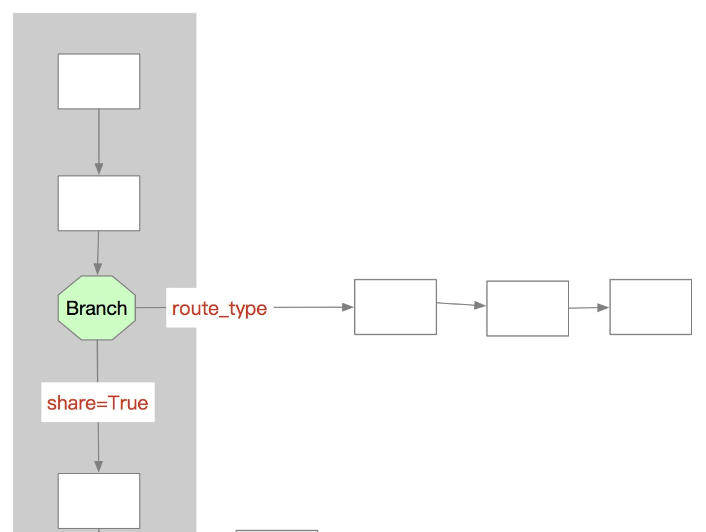

Branch,Return,Filter
====================

:share: True|False.  if keep the orignal data for parent pipe

:route_type: list of Type for route upflow message to Branch

:join: True|False  ,if Return the final message to parent  Pipe.

